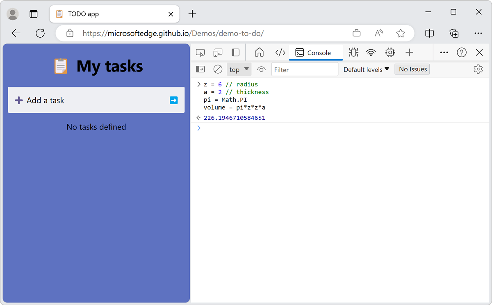

# JavaScript

### Типизатсияи чавасткрипт динамичискиай. Ва чавасткриптро барои зинда кардани вебсайт сохтаанд.Чавасткрипт ин единий забони барномасози мебошад.
# Who create Javascript ?

### Чавскриптро Brendan Eich дар мудати 10 руз сохтааст. Номи аваали чавасткрипт Mocha будааст. Баъдан номашро liveScript мемонанд.Дар охир номашро JfvfScript монданд.

# Run in JavaScript

### 3 тарзи ран кардан дар чаваскрипт мавчуд аст.

#### 1 Бо истифода аз кансол;

#### 2 Бо истифода аз нод чc;

#### 3 ба воситаи код раннер;

# Variables in Js

## Variebles-ин якк каробкае мебошад,ки дар дарунш мо ягончи хранить мекнем.

### 3 рохи сохтани перемени дар чаваскрипт мавчуд аст.

#### 1 var;

#### 2 let;

#### 3 const;

## Var-глобалниай, let and const-локалний.Дар const мо танхо як киммат хранить карда метавонем.

# Datatype in JavaScript

## Дататайпхоро дар чаваскрипт ба 2 гурух чудо кардаанд.

### 1 Primitive
#### number
##### намбер ин ракам (число) мебошад.
#### string

##### Стригн ин харф мебошад.
#### boolean

##### true and faldse
#### null

#### underfined
#### symbol
#### Bigint
### 2 Object

#### Object
#### array

#### function

# Operators in JavaScript  ?
## Arithmetics
### +,-,*,/;
## Comparison
### ==,===,>=,<=,!=,!==>;
## Logical
### ||,&&,!;
## Assignment
### =,+=,-=,*=,/=,%=;

# There three type of condition  ?
## 1. If/else;
## 1. swich case;
## 1. Ternary operator;

# There are three type of Loop   ?
## For;
## While;
## DoWhile;

 # Function 
 ## 3 намуди навиштани Function мавчуд аст:
 ### Function declaration
-768.png)
 ### Function expression

 ### Function IIFE (Immediately Invoked)

# Function expression 2хел мешавад:
## Arrow function

## Anonymous function

## Фарки function declaration аз дигар function-хо ин аст ки мо function declaretion-ро дар хама чо фарёд дода метонем. Дигар function -хоро танхо дар поёни кодхо фарёд карда метавонем.

